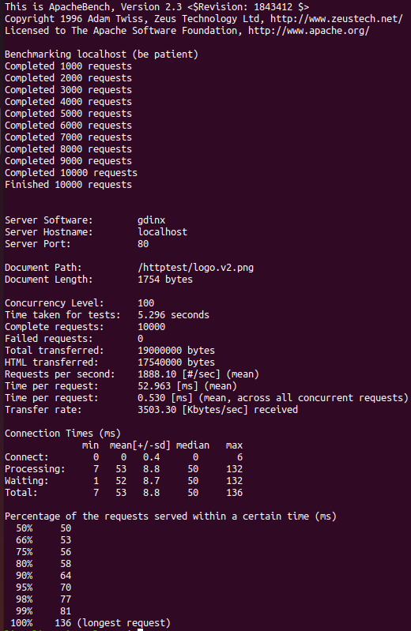

# HighLoadWebServer

C++ fork web server using boost::asio.

## Задание:
1. Разработать веб-сервер для отдачи статики с диска. Язык программирования и технологию многопоточной обработки соединений выбрать самостоятельно. Разрешается использовать библиотеки, помогающие реализовать асинхронную обработку соединений (libevent/libev и им подобные), запрещается использовать библиотеки, реализующие мультипоточную обработку или какую-либо часть обработки HTTP. Запрещено использование языков Go и Node.js по причине встроенной многопоточности.
2. Провести нагрузочное тестирование, проверку стабильности и корректности работы (требования и методика тестирования по ссылке: https://github.com/init/http-test-suite).

## Запуск:
```
docker build -t lisa-bella97 .
docker run -t -p 80:80 lisa-bella97:latest
```

В случае перезапуска выполнить следующую команду:
```
docker kill $(sudo docker ps -q)
```

## Прогон тестов:
```
git clone https://github.com/init/http-test-suite.git
./http-test-suite/httptest.py
```

## Нагрузка через ab:

```
ab -n 1000 -c 100 localhost/httptest/wikipedia_russia.html
```

## Запуск nginx:
```
docker run -it -v {path_to_project}/http-test-suite:/usr/share/nginx/html:ro -p 80:80 nginx
```

## My server RPS:


## Nginx RPS:


